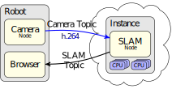
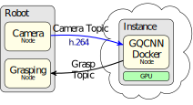
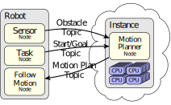

FogROS 2 is an open-source cloud-robotics pilot platform from UC Berkeley.  Cloud computing using commercial clusters such as Amazon Web Services (AWS) is now fast enough to enable secure compute-intensive robot functions such as SLAM map building from video, grasp planning, and high dimensional motion planning to be performed in the Cloud using high-performance hardware and GPUs in near real-time.   FogROS 2 offers ROS 2 functions to streamline the deployment of robot code. Developers do not need to change their code–they need only to specify an AWS configuration of computers that they want their code to run.  FogROS 2 coordinates the details of initiating hardware instances, installing software and dependencies, securing robot-cloud communication, and launching cloud processes.

In example applications, we used FogROS 2 to deploy compute-intensive ROS 2 nodes for SLAM, Grasp Planning, and Motion Planning to the cloud.  For Visual SLAM, we ran an [ORB-SLAM 2](https://github.com/raulmur/ORB_SLAM2) Node on a multi-core cloud computer and we got a 2x speedup.  For Grasp Planning, we ran the [Dex-Net](https://github.com/BerkeleyAutomation/dex-net) Node on a GPU instance in the cloud and got a 12x speedup.  For Motion Planning, we ran [Motion Planning Templates](https://robotics.cs.unc.edu/mpt/) on a 96-core cloud computer and got a 28x speedup.

